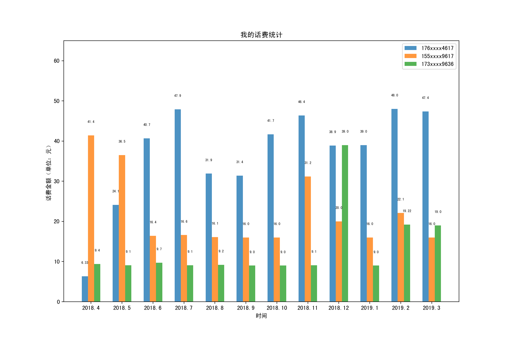
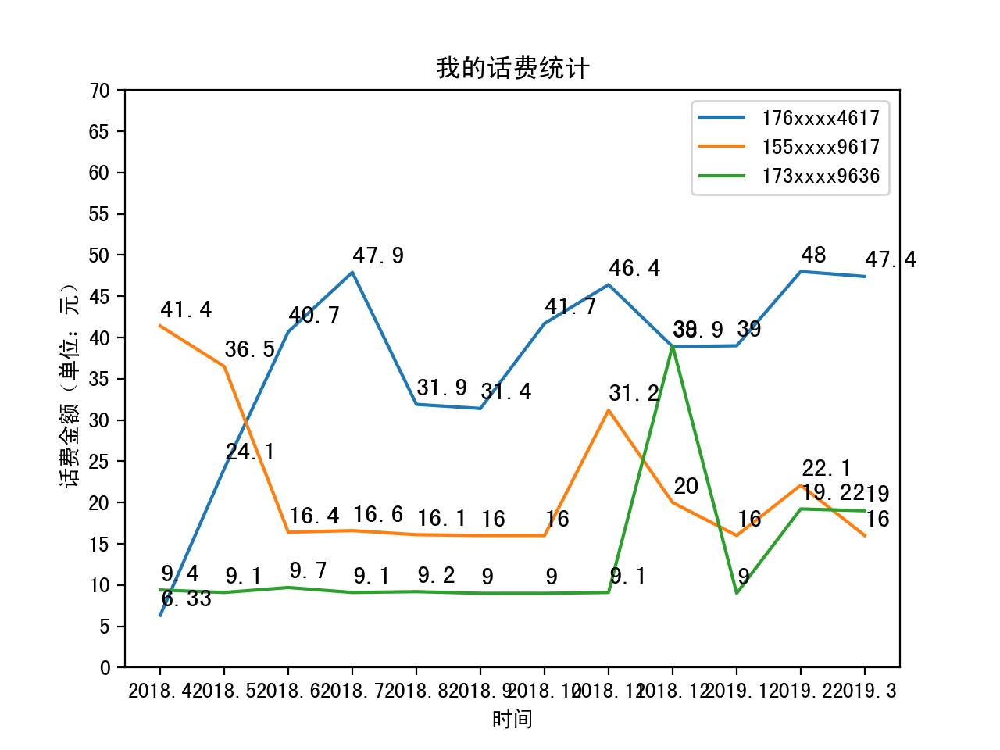
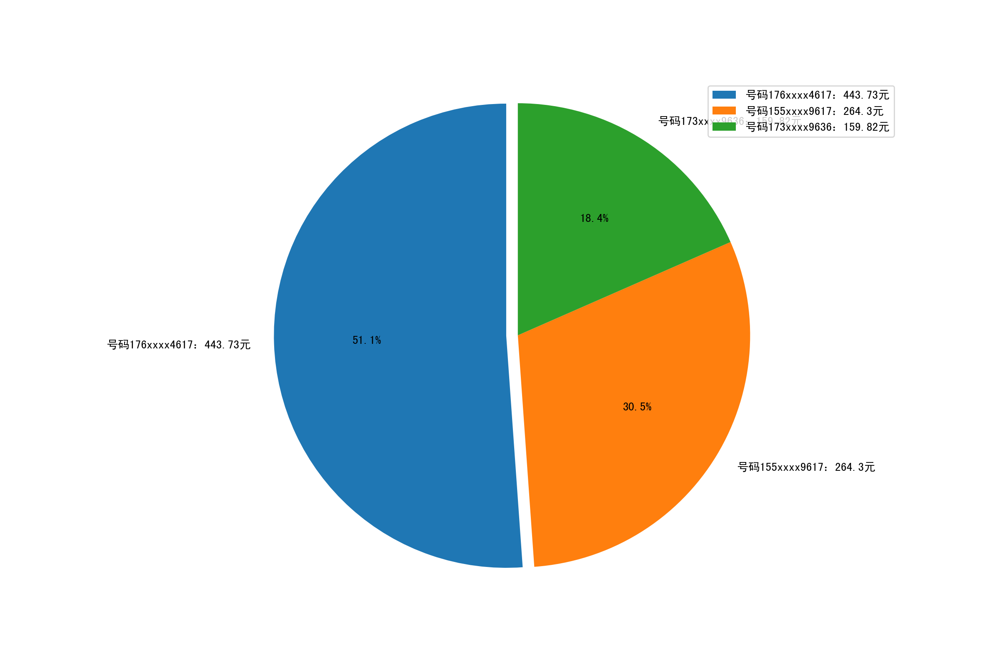

# python_analysis
使用python生成柱状图、曲线图、饼状图

## 环境

- macOS
- PyCharm

## 依赖库

- matplotlib
- numpy

## 中文字体

[SimHei](https://www.fontpalace.com/font-details/SimHei/)

## 步骤详解

### 一、配置依赖包

使用pycharm，直接依赖 matplotlib，如果当前环境变量的pip中不包含 matplotlib 库则会报错，根据IDE提示自动下载 matplotlib 库

```python
import matplotlib
```

### 二、配置中文字体

下载中文字体文件 [SimHei](https://www.fontpalace.com/font-details/SimHei/) 并双击则安装到操作系统的字体库，然后输入一下代码找到 matplotlib 库的字体目录

```python
import matplotlib
print(matplotlib.matplotlib_fname())
```

1. 参考输出`/usr/local/lib/python3.7/site-packages/matplotlib/mpl-data/matplotlibrc`
2. 打开finder（访达）并按command+shift+g
3. 输入上面得到的路径并前往
4. 找到 matplotlib 字体文件库，如`/usr/local/lib/python3.7/site-packages/matplotlib/mpl-data/fonts/ttf`
5. 将下载的SimHei.ttf文件拷贝到这里
6. 找到字体配置文件 matplotlibrc 可能在`/usr/local/lib/python3.7/site-packages/matplotlib/mpl-data/`目录下
7. 修改其中的以下三项
8. 重新加载字体配置使新增字体生效

matplotlibrc配置
```
font.family         : sans-serif        
font.sans-serif     : SimHei, Bitstream Vera Sans, Lucida Grande, Verdana, Geneva, Lucid, Arial, Helvetica, Avant Garde, sans-serif   
axes.unicode_minus:False
```

重新加载字体配置
```python
from matplotlib.font_manager import _rebuild
_rebuild()
```

### 三、准备数据源

```
mobile_176xxxx4617 = [6.33, 24.1, 40.7, 47.9, 31.9, 31.4, 41.7, 46.4, 38.9, 39, 48, 47.4]
mobile_155xxxx9617 = [41.4, 36.5, 16.4, 16.6, 16.1, 16, 16, 31.2, 20, 16, 22.1, 16]
mobile_173xxxx9636 = [9.4, 9.1, 9.7, 9.1, 9.2, 9, 9, 9.1, 39, 9, 19.22, 19]
time = ['2018.4', '2018.5', '2018.6', '2018.7', '2018.8', '2018.9', '2018.10', '2018.11', '2018.12', '2019.1', '2019.2', '2019.3']
```

### 四、生成统计图

- 柱状图 module_histogram.py
- 折线图 module_line_graph.py
- 饼状图 module_pie_chart.py

### 五、效果预览图

柱状图



折线图



饼状图

